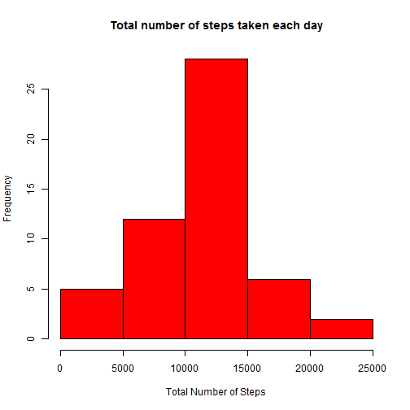
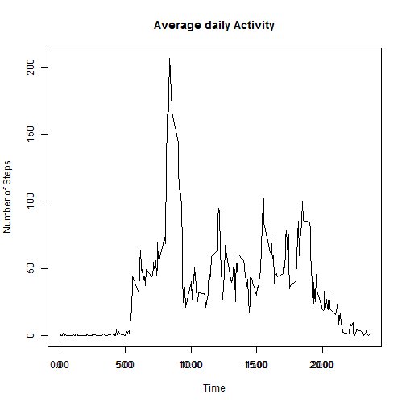
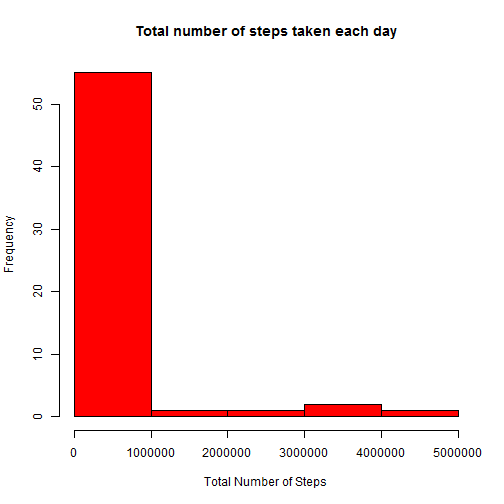
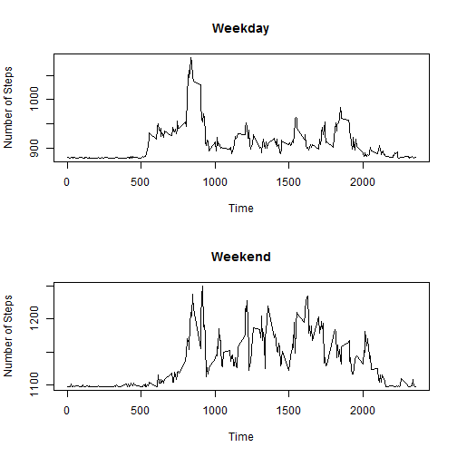

# Reproducible Research: Peer Assessment 1


## Loading and preprocessing the data


Read the "activity.csv" file into a dataframe called as "activity_DF". Remove the NA's from this dataframe.

```r
activity_DF <- read.csv("activity.csv")
activity_DF_WNA <- activity_DF[complete.cases(activity_DF), ]
```


Convert the row.names into a sequential format 

```r
row.names(activity_DF_WNA) <- NULL
```


Convert the "date" coloumn of activity_DF_WNA from type 'factor' to type 'date'

```r
activity_DF_WNA[, "date"] <- as.Date(activity_DF_WNA[, "date"], "%Y-%m-%d")
```


The structure of 'activity_DF_WNA' is as follows:

```r
str(activity_DF_WNA)
```

```
## 'data.frame':	15264 obs. of  3 variables:
##  $ steps   : int  0 0 0 0 0 0 0 0 0 0 ...
##  $ date    : Date, format: "2012-10-02" "2012-10-02" ...
##  $ interval: int  0 5 10 15 20 25 30 35 40 45 ...
```


## What is mean total number of steps taken per day?

Create a new data.frame with just the coloumns for 'steps' and 'Date'

```r
act_DF_steps_date <- activity_DF_WNA[, c("steps", "date")]
```


Load the package 'data.table'

```r
library(data.table)
```


Convert this new data.frame into a data.table

```r
act_steps_date_DT <- data.table(act_DF_steps_date)
```


Group the data.table by each 'date' and calculate the sum of the number of steps for each day.Rename the column corresponding to the total number of steps.

```r
act_steps_date_group <- act_steps_date_DT[, sum(steps), by = "date"]
setnames(act_steps_date_group, "V1", "steps")
```


Generate a Histogram for the total number of steps taken each day

```r
hist(act_steps_date_group$steps, main = "Total number of steps taken each day", 
    col = "red", xlab = "Total Number of Steps", ylab = "Frequency")
```

 


Calculate the mean for total number of steps taken each day

```r
options(digits = 8)
mean(act_steps_date_group$steps)
```

```
## [1] 10766.189
```


Calculate the median for total number of steps taken each day

```r
median(act_steps_date_group$steps)
```

```
## [1] 10765
```

## What is the average daily activity pattern?

Add a 'time' column to the original data.frame 'activity_DF_WNA' by formatting the 'interval coloumn.

```r
activity_DF_WNA$time <- sapply(activity_DF_WNA$interval, formatC, width = 4, 
    flag = 0)
```


Extract the 'time' and 'steps' column from the above data.frame

```r
act_DF_steps_interval <- activity_DF_WNA[, c("time", "steps")]
```


Convert the above data.frame to a data.table

```r
act_steps_interval_DT <- data.table(act_DF_steps_interval)
```


Group the above data.table by time and taking average of the number of steps.Rename the column corresponding to the average number of steps

```r
act_steps_interval_group <- act_steps_interval_DT[, mean(steps), by = "time"]
setnames(act_steps_interval_group, "V1", "steps")
```


Plot a graph of time v/s average daily number of steps. This represents the average daily activity pattern.


```r
lab <- c("0:00", "5:00", "10:00", "15:00", "20:00")
x <- plot(act_steps_interval_group$time, act_steps_interval_group$steps, type = "l", 
    ylab = "Number of Steps", xlab = "Time", main = "Average daily Activity")
axis(1, at = c(0, 500, 1000, 1500, 2000), labels = lab)
```

 


Compute the 5-minute interval on average across all the days in the dataset which contains the maximum number of steps

```r
act_steps_interval_group[act_steps_interval_group$steps == max(act_steps_interval_group$steps), 
    ]
```

```
##    time     steps
## 1: 0835 206.16981
```


Hence, the 5-minute time interval on average across all the days in the dataset which contains the maximum number of steps is between 
08:30 and 08:35


## Imputing missing values


Convert the 'date' coloumn of the original data.frame consisting of NA's into class 'character'. 

```r
activity_DF$date = as.character(activity_DF$date)
```


Convert the 'date' coloumn of the 'act_steps_date_group' data.frame to class 'character'.

```r
act_steps_date_group$date = as.character(act_steps_date_group$date)
```


merge the above two data.frames by 'date'.

```r
temp = merge(activity_DF, act_steps_date_group, by = "date", suffixes = c(".activity_DF", 
    ".act_steps_date_group"))
```


Compute the row numbers in 'activity_DF' which are NA's and store them in a vector.

```r
na.idx = which(is.na(activity_DF$steps))
```


Replace the NA values for the coloumn 'steps' in the original data.frame with average values of the respective date.

```r
activity_DF[na.idx, "steps"] = temp[na.idx, "steps.act_steps_date_group"]
```


Remove the remaining NA values which correspong to days when there was no activity at all.

```r
activity_DF_new <- activity_DF[complete.cases(activity_DF), ]
```


The above data.frame has all the missing values imputed.

Extract the 'time' and 'steps' column from the above data.frame

```r
act_DF_steps_interval <- activity_DF_new[, c("steps", "date")]
```


Convert this data.frame into a data.table

```r
activity_DT_new <- data.table(act_DF_steps_interval)
```


Group the data.table by each 'date' and calculate the sum of the number of steps for each day.Rename the column corresponding to the total number of steps.

```r
act_steps_date_group <- activity_DT_new[, sum(steps), by = "date"]
setnames(act_steps_date_group, "V1", "steps")
```


Generate a Histogram for the total number of steps taken each day

```r
options(scipen = 10000)
hist(act_steps_date_group$steps, main = "Total number of steps taken each day", 
    col = "red", xlab = "Total Number of Steps", ylab = "Frequency", breaks = 5)
```

 


Calculate the mean for total number of steps taken each day

```r
mean(act_steps_date_group$steps)
```

```
## [1] 279514.93
```


Calculate the median for total number of steps taken each day

```r
median(act_steps_date_group$steps)
```

```
## [1] 11405
```


As a result of imputing the activity data, there is a large difference between the mean and the median and the number of steps are not distributed evenly. 
## Are there differences in activity patterns between weekdays and weekends?

Load the acitvity data into a new data.frame & set the coloumn class as a date.

```r

activity_DF_week <- activity_DF_new
activity_DF_week[, "date"] <- as.Date(activity_DF_week[, "date"], "%Y-%m-%d")
```


Extract the date coloumn from the activity data.frame and use the weekday function to classify as a weekday or weekend. 

```r
week_vect <- weekdays(activity_DF_week$date)
week_vect_new <- character()
for (i in week_vect) {
    if (i %in% c("Monday", "Tuesday", "Wednesday", "Thursday", "Friday")) {
        week_vect_new <- append(week_vect_new, "weekday")
    } else {
        week_vect_new <- append(week_vect_new, "weekend")
    }
    
}
```


Add the day_type indicator to the activity data.frame

```r
activity_DF_week$day_type <- week_vect_new
```


Store the weekday and weeknd data into seperate data.frames respectively.

```r
week_day_data <- activity_DF_week[activity_DF_week$day_type == "weekday", ]
week_end_data <- activity_DF_week[activity_DF_week$day_type == "weekend", ]
```


Calculate the average number of steps taken, averaged across all weekdays

```r
week_day_data$time <- sapply(week_day_data$interval, formatC, width = 4, flag = 0)
week_day_data <- week_day_data[, c("steps", "time")]
week_day_data_T <- data.table(week_day_data)
week_day_data_group <- week_day_data_T[, mean(steps), by = "time"]
setnames(week_day_data_group, "V1", "steps")
```


Calculate the average number of steps taken, averaged across all weekdends

```r
week_end_data$time <- sapply(week_end_data$interval, formatC, width = 4, flag = 0)
week_end_data <- week_end_data[, c("steps", "time")]
week_end_data_T <- data.table(week_end_data)
week_end_data_group <- week_end_data_T[, mean(steps), by = "time"]
setnames(week_end_data_group, "V1", "steps")
```


Draw a plot containing a time series plot of the 5-minute interval and the average number of steps taken, averaged across all weekday days or weekend days 


```r
par(mfrow = c(2, 1))

plot(x = week_day_data_group$time, y = week_day_data_group$steps, type = "l", 
    xlab = "Time", ylab = "Number of Steps", main = "Weekday")
plot(x = week_end_data_group$time, y = week_end_data_group$steps, type = "l", 
    xlab = "Time", ylab = "Number of Steps", main = "Weekend")
```

 

```r

```


